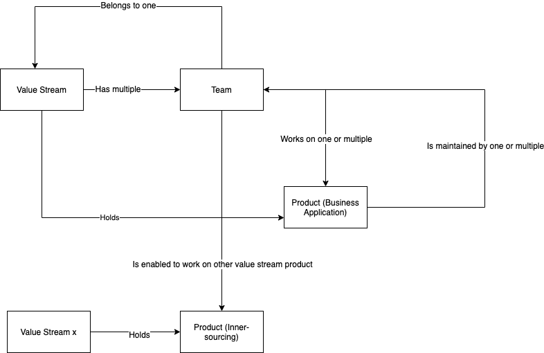
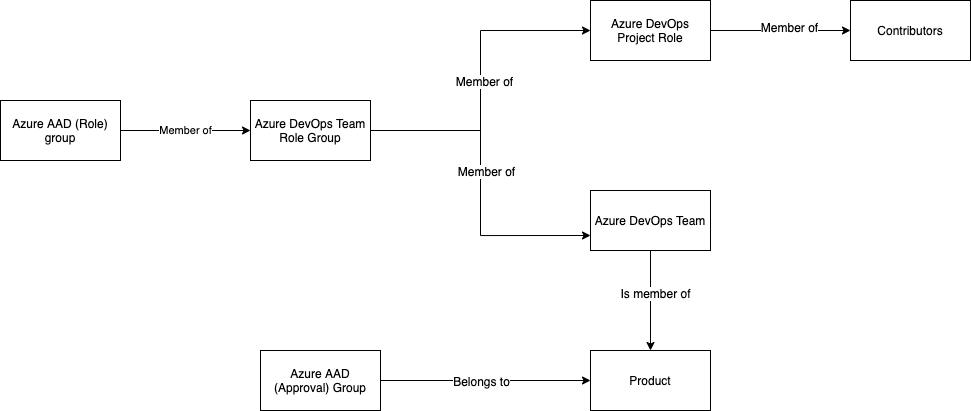

# Introduction

## The idea

I love Azure DevOps. It is a great environment for your SDLC. But... in my experience there is one flaw in Azure DevOps and that is the way how permissions are arranged. The general idea with different security groups, maintain Build-, Release-, Serviceconnection Administrators and as a contributor you can't even create a Git Repository, is in my opinion flawed and not fit for the 2020's where a DevOps culture seems to get more common ground.

In the (enterprise) organizations I've worked at, there were allot of trouble with onboarding Teams, Tribes (Spotify Model) and Products. Developers are smart and you need to trust them so the different security groups are no longer valid. But what is valid is to enable different 'Approval Groups' to obtain the 'Segregation of Duties' and 4-eye principles.

The idea is simple:

- An organization consists in Value Streams (or Tribes or Business Units);
- Per Value Stream you have multiple teams;
- One ore more teams are working on a Product;
- Users are added not in Azure DevOps but with Azure Active Directory Groups;

My idea do best fit in the following diagram:

The following diagram gives an impression about how the groups works together.

## The setup

This idea consists of three git repositories:

- [The Azure DevOps Onboarding Api](https://github.com/JoostVoskuil/azure-devops-onboarding-api)
- [The Azure DevOps Onboarding Example Extension](https://github.com/JoostVoskuil/azure-devops-onboarding-extension)
- [The Azure DevOps Onboarding Configuration](https://github.com/JoostVoskuil/azure-devops-onboarding)

### The Azure DevOps Onboarding Api

The Azure DevOps Onboarding Api is an abstraction layer on top of the normal Azure DevOps Api. It uses the azure-devops-node-api for it's functionality. There were two main reasons to create an abstraction layer:

- The azure-devops-node-api does not provide all capabilities of the Azure DevOps API;
- The Azure DevOps Api is great but it is not user friendly, it works with Id's and especially the security, entitlement Api's are hard to get grip on. It requires multiple get's en posts to get something done.

You can use the onboarding Api from every node based application you want.

For more information on the Azure DevOps Onboarding Api, see the [Git Repository](https://github.com/JoostVoskuil/azure-devops-onboarding-api/README.md).

### The Azure DevOps Onboarding Example Extension

The Azure DevOps Onboarding Example Extension consists of two tasks that uses the onboarding Api. In the extension you can create your own onboarding flow/sequence. I decided to create an extension for this so you can create pipelines for your onboarding and configuration purposes. Also, in this way you can create self-service pipelines for your teams.

For more information on the Azure DevOps Onboarding Example Extension, see the [Git Repository](https://github.com/JoostVoskuil/azure-devops-onboarding-extension/README.md).

### The Azure DevOps Onboarding Configuration

The configuration repository contains an example configuration that combines the onboarding API and the flow set in the extension. With configuration I mean:

- What roles do you define in your organization;
- What are the permissions that you give your roles;
- What is the default variable groups you want to distribute;
- What is the git cross-repo policies that you want to set;
- What naming conventions do you want to use;

For more information on the Azure DevOps Onboarding Configuration, see the [Git Repository](https://github.com/JoostVoskuil/azure-devops-onboarding/README.md).

# The Azure DevOps Onboarding Configuration

The configuration specified in this repo works together with the onboarding API and the example extensions. It gives an impression what can be done and is configurable.

## Roles

In the Roles.json file the different roles are specified for your organisation. Here you can specify roles like Developer, Opser and PO/SM. It does two things:

1) During Project onboarding it creates the Security Group for All teams (like Developers). With the projectpermissions you can set the permissions for each securitygroup on project level.
2) During Team onboarding it creates the Security Group (and corresponding AAD group) with the Teamname and then the PostFixName. This is important for Segregation of duties.

## Global configuration (configuration.json)

### General

| Setting  | Comment  |
|---|---|
| TESTING  | DANGER: When set to true it will delete TeamProjects when exists during the creation of teamprojects. |

### Azure DevOps settings

| Setting  | Comment  |
|---|---|
| AZURE_DEVOPS_ORGANISATION  | The Azure DevOps organisation  |
| AZURE_DEVOPS_ORGANISATION_URL  | The Azure DevOps Url  |
| AZURE_DEVOPS_ORGANISATION_VSSPS_URL| The Azure DevOps Url for VSSPS  |
| AZURE_DEVOPS_ORGANISATION_VSAEX_URL| The Azure DevOps Url for VSAEX  |

### API Settings

| Setting  | Comment  |
|---|---|
| AZURE_DEVOPS_API_TIMEOUT  |  Timeout settings fot the Rest API of Azure DevOps |
| AZURE_DEVOPS_API_MAX_RETRIES  | Maximum retries for the API  |
| AZURE_DEVOPS_API_ALLOWRETRIES  | If the rest client is allowed to retry  |
| AZURE_DEVOPS_API_MAX_ITEMS_TO_RETREIVE | For some API's this is the number of items to retrieve, default this is 100 |

### Project Settings

| Setting  | Comment  |
|---|---|
| TEAM_PROJECT_PROCESS_TEMPLATE_ID  |  The process template to use. This GUID is the default value for Scrum |
| MAX_LOOP_FOR_PROJECT_QUEING  | Loop setting for the quiing for creation and deletion for team projects  |
| AZURE_DEVOPS_SECURITY_GROUP_PREFIX  | A default prefix that you can use for the creation of Azure DevOps groups  |
| AZURE_DEVOPS_VALUESTREAM_TEAM_PREFIX | A default prefix that you can use for the creation of Azure DevOps groups |
| AAD_PROJECT_READER_GROUP_PREFIX | A default prefix that you can use for the creation of AAD groups |

### Team Settings

| Setting  | Comment  |
|---|---|
| AAD_TEAM_GROUP_PREFIX  |  A default prefix that you can use for the creation of AAD groups for teams |
| AZURE_DEVOPS_INNERSOURCE_TEAM_GROUP_PREFIX  | A default prefix that you can use for the creation of Azure DevOps groups for teams |
| AZURE_DEVOPS_TEAM_GROUP_PREFIX  | A default prefix that you can use for the creation of Azure DevOps groups for teams |

### Product Settings

| Setting  | Comment  |
|---|---|
| AAD_PRODUCT_GROUP_PREFIX  |  A default prefix that you can use for the creation of AAD groups for products |
| AZURE_DEVOPS_INNERSOURCE_PRODUCT_GROUP_PREFIX  | A default prefix that you can use for the creation of Azure DevOps groups for products |
| AZURE_DEVOPS_PRODUCT_GROUP_PREFIX  | A default prefix that you can use for the creation of Azure DevOps groups for products |

### Permission Settings

| Setting  | Comment  |
|---|---|
| CONFIG_PROJECTPERMISSIONFILE  |  The project permission configuration file  |
| CONFIG_BUILDFOLERPERMISSIONFILE  | The permission configuration file for build folders |
| CONFIG_RELEASEFOLERPERMISSIONFILE  | The permission configuration file for release folders|
| CONFIG_GITPERMISSIONFILE  | The permission configuration file for git repositories|
| CONFIG_SIMPLEOBJECTPERMISSIONFILE  | The permission configuration file for other objects|

### Other Settings

| Setting  | Comment  |
|---|---|
| CONFIG_GITPOLICYFILE  |  The project permission configuration file  |
| CONFIG_PROJECTVARIABLEGROUPFILE  | The variable group template that will be used for Project creation |
| CONFIG_PRODUCTVARIABLEGROUPFILE  | The variable group template that will be used for Product creation |
| CONFIG_GITPOLICYFILE  | Settings for the Git cross-repo Policies |
| DEFAULTAGENTQUEUES  | Comma seperated list of the agent Queues where the permissions needs to be set |

## Project Permissions (projectsecuritypermissions.json)

The project permission file specifies the permissions for the whole team project. It handles security per group. The group is specified with the value 'Group' and the 'GroupScope' determines what the scope is of the group. Valid settings are 'ProjectGroup' (for Security Groups in the current Project) or 'OrganisationGroup' (for Security Groups in the organisation). Per namespace you can set the permissions. The NamespaceId is mandatory.
For more information on Security Namespaces, see the [Azure DevOps API](https://docs.microsoft.com/en-us/rest/api/azure/devops/security/security%20namespaces?view=azure-devops-rest-5.1). To see the security namespaces (and actions) of your project query: GET https://dev.azure.com/{organization}/_apis/securitynamespaces?api-version=5.1

## Complex Object Permissions (buildfolder-, releasefolder- & gitrepo- permissions.json)

When onboarding new teams or products folders (and repo's) are created. The permisions are specified in these files. There are two options:

1) Set GroupScope to 'ProjectGroup' and specify the Group with 'Group' to target the general permissions, like Contributors
2) Set GroupScope to 'Group' (Group can be left empty) to specify the permissins of the owner (Team or Product)

## Simple Object Permissions (simpleobjectpermissions.json)

For simple objects (like Variablegroups or Service connections) this is a simple permission setting. Here you can specify the permissions of the owner (team or product) and the permissions of the contributor group.

## Variable Groups

These are templates. When a new project is created the variablegroup specified in productvariablegroup.json is created. The same appies for the product variable group

### Project Policies (projectpolicies.json)

Specifies the Git Cross-Repo policy settings. See [the Azure DevOps API documentation](https://docs.microsoft.com/en-us/rest/api/azure/devops/policy/?view=azure-devops-rest-5.1) for more information.

### Worth knowing

In this current example, every contributor can create:

- Service connections
- Variable groups
- Secure files
- Environments
- Deployment groups

However, that contributor is allocated as 'Creator'. Other users are allocated as 'Readers' per default and cannot use that resource.

The creator of the resource has two responsabilities:

- Remove the 'Grand access to all pipelines' flag so that pipelines cannot use that resource
- Put the security group for his/her team or product as Administrator to administer that resource. Because the team/product has > Use rights, not authorization is needed.

These resources must be authorized to use in Pipelines.

Resources that are open to use:

- Agent Pools
- Shared Service Connections

## Example Pipelines

Supplied are onboarding examples that work together with the 'variablegroup.json' that you need to import. In this way you can create self-service pipelines. In the variablegroup also the secret tokens are specified.

## How to create an Application in AAD

1) Go to [Azure Portal](https://aad.portal.azure.com)
2) Click on 'Azure Active Directory'
3) Go to 'App registrations'
4) Create a 'New registration'
   1) Specify name: Azure DevOps onboarding
   2) Specify account type: choose what is best for your fit
   3) Redirect Uri: Web / [localhost:3000](https://localhost:3000) (does not matter)
5) Press 'Register'
6) Note: Application (client) ID
7) Note: Directory (tenant) ID
8) Goto 'Endpoints'
9) Note: OAuth 2.0 token endpoint (v2)
10) Go to 'API permissions'
11) Remove the 'Microsoft.Graph' / 'User.Read' permission so the list is empty
12) Press 'Add permissions', choose 'Microsoft Graph' and choose 'Application permissions'
13) Select 'Group.Create' and 'Group.Read.All'
14) Add the permissions and give consent
15) Go to 'Certificates & secrets'
16) Add a new client secret
17) Add a client secret and set the expire time. Note down this token

### Adjust the configuration

The 'Application (client) ID' need to be set in the configuration.json as value for field: MS_GRAPH_APP_ID
The 'Directory (tenant) ID' need to be set in the configuration.json as value for field: MS_GRAPH_DIRECTORY_ID
The 'Client Secret' is passed to the constructor of the onboarding API so it remains a secret

Optionally you can configure the 'OAuth 2.0 token endpoint (v2)' in the configuration.json as value for fields: "MS_GRAPH_TOKEN_ENDPOINT" and "MS_GRAPH_TOKEN_POSTFIX". The current syntax is: MS_GRAPH_TOKEN_ENDPOINT + MS_GRAPH_DIRECTORY_ID + MS_GRAPH_TOKEN_POSTFIX; The merging of the fields is done by the Onboarding API.